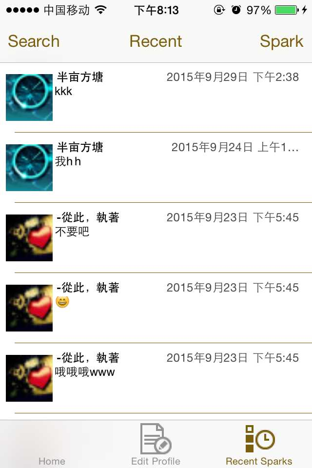

### demo-IOS-wildfeed

利用野狗Wilddog Sdk开发的类似的微博的社交应用。

## 实例

可以参考[wilddog demo](http://wildfeed.wilddogapp.com) 

[](http://wildfeed.wilddogapp.com/)

### 授权
```HTML
self.firefeed = [[Firefeed alloc] initWithUrl:@"https://feed.wilddogio.com" delegate:self];

// 监控登录状态的变化
 _authHandle = [_ref observeAuthEventWithBlock:^(WAuthData *user) {
            // This is the new style, but there doesn't appear to be any way to tell which way the user is going, online or offline?
            if ((user == nil) && (_user != nil)) {
                //[self onAuthStatusError:nil user:nil];
            }
        }];
```


## 本地运行

首先确认本机已经安装Xcode 运行环境，然后执行,模拟器或者真机：

```
git clone git@github.com:WildDogTeam/demo-ios-wildfeed.git

```


## 支持
如果在使用过程中有任何问题，请提 [issue](https://github.com/WildDogTeam/demo-ios-wildfeed/issues) ，我会在 Github 上给予帮助。

## 相关文档

* [wildfeed js版本](https://github.com/WildDogTeam/demo-js-wildfeed)
* [Wilddog 概览](https://z.wilddog.com/overview/guide)
* [IOS SDK快速入门](https://z.wilddog.com/ios/quickstart)
* [IOS SDK 开发向导](https://z.wilddog.com/ios/guide/1)
* [IOS SDK API](https://z.wilddog.com/ios/api)
* [下载页面](https://www.wilddog.com/download/)
* [Wilddog FAQ](https://z.wilddog.com/faq/qa)


## License
MIT
http://wilddog.mit-license.org/

## 感谢 Thanks

We would like to thank the following projects for helping us achieve our goals:

Open Source:

* [firefeed](https://github.com/firebase/iFirefeed) Firefeed is a IOS app that lets users post small messages called sparks to their feed. You can follow other users, and their sparks will appear on your feed


